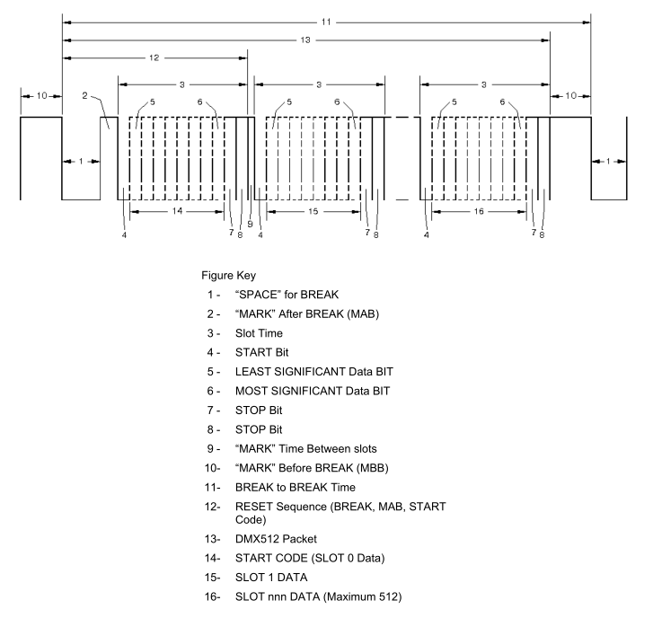

# DMX512

DMX512(Digital Multiplex 512)는 디지털 조명제어 통신 네트워크의 표준 프로토콜입니다.

쉽게 말해 조명기구와 조명컨트롤러 간 통신을 위한 약속입니다.

DMX512는 가정 또는 캠핑시 사용하는 구슬전구부터 경기장, 콘서트의 대형 조명시스템에 이르기까지 다양한 규모와 용도로 사용되고 있습니다.

최근에는 RDM(원격 장치 관리), IP 등의 프로토콜이 DMX512를 보완하여 양방향 통신을 지원하기도 하지만 DMX512는 높은 호환성과 신뢰도, 확장성을 바탕으로 여전히 현장에서 주력으로 사용되고 있는 프로토콜이다.

자세한 기술규격은 'ESTA ANSI E1.11'에서 확인 할 수 있습니다.

## 주요특징

- DMX512는 비동기 직렬 데이터 전송 방식을 사용합니다.
- RS-485 전기 신호 표준을 기반으로 장거리 전송과 다수의 수신 장치를 지원하기위해 설계되었습니다.
- 하나의 DMX512네트워크는 최대 512개의 개별 채널을 지원합니다.
- 각 채널은 8비트 데이터(0~255)를 전송하여 조명기기의 속성을 제어합니다.
- 프레임의 시작은 브레이크 신호(길이가 긴 로우 신호)로 표시되며, 이는 수신 장치에게 새로운 프레임이 시작됨을 알립니다.
- XLR 커넥트 3핀 또는 5핀으로 배선을 구성합니다. 배튼에 설치된 C플러그 역시 많이 사용합니다.
- DMX512 장치는 일반적으로 **데이지 체인(Daisy Chain) 방식**(또는 버스 토폴로지)으로 연결됩니다.

## 데이터 프로토콜

1. 형식 : DMX512 슬롯은 비동기식 직렬 형식으로 순차적으로 전송되며, 슬롯 0부터 마지막으로 구현된 슬롯까지 최대 512개의 슬롯(총 513개의 슬롯)을 포함할 수 있습니다. 첫 번째 데이터 슬롯이 전송되기 전에, 리셋 시퀀스가 전송되어야 합니다. 리셋 시퀀스는 BREAK, MARK AFTER BREAK, 그리고 START 코드로 구성됩니다. NULL START 코드 하에서의 유효한 DMX512 데이터 슬롯 값은 0에서 255입니다.

2. 슬롯 형식 : 각 데이터 값 전송 형식은 아래 표와 같습니다. 주의할 점은 패리티가 전송되지 않는다는 것입니다.

> | 비트위치 | 설명      |
> | -------- | --------- |
> | 1        | Start bit |
> | 2-9      | Data bit  |
> | 10,11    | Stop bit  |

3. Break : BREAK는 새로운 패킷의 시작을 나타냅니다. 송신기가 생성하는 BREAK는 마크에서 스페이스로의 전환 이후, 최소 지속 시간 동안 low 상태를 유지하고(표 6의 타이밍 다이어그램, 지정자 #1), 다시 low에서 high로 전환됩니다. 수신기가 새로운 패킷의 시작으로 인식해야 하는 최소 지속 시간은 표 7의 타이밍 다이어그램, 지정자 #1에 정의되어 있습니다.

4. Break 이후의 마크 : BREAK와 START 코드를 구분하는 MARK는 BREAK 이후의 MARK로 정의됩니다. DMX512 송신기는 표 6의 지정자 2에 대한 최소 및 최대 값을 준수하는 BREAK 이후의 MARK를 생성합니다. 수신기는 표 7에서 제시된 최소값 이상의 BREAK 이후의 MARK를 올바르게 인식해야 합니다.

5. START 코드 : START 코드는 BREAK 이후 첫 번째 슬롯(슬롯 0)입니다. START 코드는 해당 패킷의 이후 데이터의 기능을 식별합니다.

> - NULL START 코드 : NULL START 코드는 이후 데이터 슬롯을 형식이 없는 순차적인 8비트 정보 블록으로 식별합니다. NULL START 코드 패킷은 DMX512 네트워크에서 전송되는 기본 패킷입니다.
> - 조광기 클래스 데이터 : 조광기 레벨 데이터는 NULL START 코드 패킷으로 전송해야 합니다. 유효한 조광기 레벨은 0에서 255(십진수)로, 조광기 제어 입력을 나타냅니다. 값 0은 조광기 출력의 OFF 또는 최소 값을 나타내며, 값 255는 최대 출력(FULL)을 나타냅니다. 조광기는 0에서 255로 DMX512 슬롯 값을 증가시켜 최소 레벨(꺼짐)에서 최대 레벨(최대)로 페이딩해야 합니다.
> - 기타 START 코드 : 미래 확장과 유연성을 제공하기 위해 DMX512는 255개의 추가적인 비 NULL START 코드(1에서 255 십진수, 01에서 FF 16진수)를 사용할 수 있습니다. 이는 대체 START 코드(Alternate START Codes)로 지칭됩니다.

